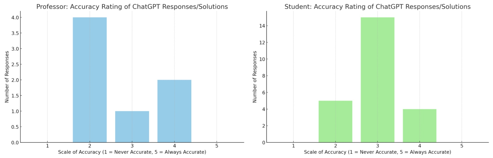

# Table of Contents

1. Concept 
1. User Research 
	2. Method
	1. Limitations
1. Research Results 
	1. Student
	1. Teacher
	1. Comparative  
1. Directions For Future Research

# HCDE DRG “AI Academia” Winter 2024
Andrew Christensen
Mia Vong

## Concept
The rapid development of generative AI poses both ethical and logistical questions regarding the use of Chat GPT in an academic setting. Considering the controversial dilemmas of copyright, plagiarism and overall original thought, do students and educators share similar or conflicting opinions surrounding the use of Chat GPT? We are interested in researching the intersection of opinions between students and educators at the University of Washington. 

Through surveying students and professors from a variety of majors at the University of Washington, we hope to answer how perspectives surrounding the emergence and use of generative AI compare between students and educators. In this research report we hope to gain insight into student and instructor perspectives and identify directions for future research on AI’s role in academia.

# User Research
## Method
We created user surveys as our research methodology to reach the widest diversity of responses. Our survey focuses on three major touchpoints surrounding AI and its use in a respective academic context: current AI use and performance, ethical consideration, and futuristic opinions. When collecting responses we ask that our participants respond honestly with the assurance that their identity will remain completely anonymous. We implemented this by not collecting email addresses from respondents and communicated our studie’s intentions within the intro of our survey. We created two separate surveys, one tailored to students and the other tailored to professors. The content between the two surveys are closely related with some phrasing alterations to ensure relevance and comprehension for each respective audience. Both surveys have identical question response metrics to ensure consistency in data analysis and comparison between student and professor perspectives.

## Overarching Research Questions: 
1. How are students and educators currently using AI in their academic environment and how is it being addressed in academic conducts?
1. What are some ethical questions and concerns surrounding generative AI and how does it impact academic learning?
1. Are opinions surrounding the use of AI for academic work different between students and educators?

## Limitations
Our greatest limitation throughout this process were response numbers. While we had a decent pool of student responses, instructor responses were far from significant with a mere seven. On top of this those instructors who did respond are, for the most part, members of a UW group about AI. Therefore our conclusions about instructors cannot really be generalized beyond this group. 

Time was also a limiting factor. Due to the tight schedule of a quarter we were forced to rely exclusively on survey data rather than our planned survey + interview format, restricting the depth of our study. In a longer study we also may have been able to collect more instructor data, thus solving the aforementioned lack of instructor responses. 

# Research Results

## Students
**Observation 1: Students use AI whether or not they understand it**
One of the first questions on our survey asked students to rate their understanding of AI from 1 (entirely unfamiliar) to 5 (expert). Most students (62.5%) gave themselves a one or two while the rest gave themselves a three or four. On its own this is not all that surprising, surveyed students were from a wide range of backgrounds many of which have little to do with AI. However 87.5% of students reported having used AI to at least aid in academic work. This means at least 50% of students surveyed have used AI to aid in academic work despite having little to no understanding of how AI itself works. Furthermore the actual understanding of those who rated themselves higher is somewhat suspect, with some respondents describing the source of their knowledge as: ChatGPT, friends, or social media/movies. Overall there is a clear discrepancy between students' understanding of AI and their willingness to use it in an academic context.

**Observation 2: Most students use AI in an assistive capacity** 
Students were asked about two different types of AI use, to assist and to complete. Assistance was described as outlining, idea generation, editing, summarizing, and other similar functions. While completion was described as answering test questions, writing papers, and writing code snippets. The vast majority of students (87.5%) reported using AI in an assistive capacity, mostly for outlining papers and coming up with ideas. On the other hand 45.8% of students surveyed said that they used AI to complete assignments for them with answering quiz questions, writing code, and writing discussion posts being the most common specific use cases mentioned. 

**Observation 3: Students are only somewhat worried about the impact of AI on their future careers**
Surprisingly 41.7% of students said they were not concerned about AI’s impact on their intended career and a further 33.3% said they were only somewhat concerned. Some of these students justified their lack of concern with requirements of their field that they felt AI could not meet. Some of these were physical limitations, a student planning to go into medicine doubting AI could do surgery. While others were more focused on the human touch, a film student argued that AI could not sufficiently replicate the human experience which they considered a requirement for film. 

## Instructors
**Observation 1: Educators commonly use generative AI in academia**
We collected responses from seven professors at the University of Washington, including two from the Computer Science department, two from the Design department, and three from the Engineering department. The majority of the professors (85.7%) indicated that they have utilized AI tools, such as ChatGPT, for various teaching activities. Specific implementations include "[using generative AI] to create design concepts, using ChatGPT to write outlines" (P3: Industrial Design) and "debugging student code, cross-referencing definitions of terms" (P7: HCDE). This demonstrates that educators across different disciplines use ChatGPT in their academic professions, either directly in teaching materials or as a teaching aid. For instance, a design professor mentioned how AI aids in creating design concepts, whereas a HCDE professor utilized AI from a technical coding perspective.

**Observation 2: Educator’s area of teaching may influence viewpoints on AI ethical issues** 
Throughout this direct research group (DRG), we have read, analyzed, and discussed the intersection of AI with creativity, art, and original thought. One particularly insightful piece of qualitative data we obtained from the teacher survey was their opinions surrounding AI ethics. Participant 4, a Design Professor, stated that generative AI could pose potential ethical concerns regarding "outsourcing critical thinking processes" (P4: Design). This response was intriguing due to the professor's role as a design educator, raising questions about whether a creative background influences ethical concerns regarding generative AI. Further research is needed to explore how an individual's connection to design might affect their perspective on AI's relationship with art, design, and creativity.

**Observation 3: Educators have strong concerns regarding future AI’s impact in the job market**
Six out of the seven professor respondents responded to the short answer prompt, “If you are concerned about future job markets, which professions are you concerned about?”. Two out of the 6 professors responded initially with, “Almost every industry” (P4: Design) and “There are many…” (P5: CSE).The insights from professors in design and computer science reflect a broader concern about AI's impact on society outside of the academic environment. Professors went on to elaborate on how AI could potentially threaten content generation, knowledge work, creative work, and undervaluing human labor. This demonstrates how, from an educator's perspective, AI systems may raise concerns about human intelligence and creativity within the workplace.

# Comparative

**Contrasting perspectives on ChatGPT's accuracy**

\*Graphs generated by chat GPT 4.0 
Although we lack a large representative sample size for professors compared to students, there still seems to be a contradiction between how students and professors rate the accuracy of ChatGPT’s model. As depicted in the bar charts above, the majority of teachers rated the accuracy of ChatGPT a 2 (somewhat accurate) versus the majority of students giving the AI model a 3 (accurate). Based on this observation, we may infer that the role of a student versus educator may impact how well they perceive generative AI accuracy. A confounding factor we’d like to address is how the model of ChatGPT a participant uses will affect response accuracy and we cannot tell this information from the collected data. Another limitation is the overall participant size of our teacher study doesn’t allow us to perform a strong comparative analysis between the student study. 

**Contrasting perspectives on frequency of AI use** 
Do professors have an accurate perception of how often students use AI in the classroom? Well according to our admittedly small sample of instructors, it seems they do. When asked how often they think students use AI in their coursework, professors averaged a rating of 4 out of 5. When asked to rate how often they and their peers use AI tools in coursework, the students surveyed also reported an average of a 4 out of 5. When the roles are flipped it seems that students also have a somewhat accurate understanding of the frequency with which their instructors use AI tools in an academic setting. 

# Directions For Future Research
Through this study we learned a lot about student and instructor perspectives on AI in an academic setting. Unfortunately because of time constraints we were only able to collect surface level data, but we have identified areas worth exploring further in future studies. On the student side of things we believe there is a lot more to be learned about students' understanding of AI and their willingness to use it as well as how students feel about different use cases for AI (i.e. comfortable using it to write code snippets but uncomfortable having it write essays). Instructors' perspectives on AI seemed to be impacted by their background, future studies could explore this further with a more significant data set. Our comparison of perceived vs actual use with students and instructors is another area that seems worth investigating further with a more directed study. 

Overall, despite our limitations we successfully learned about student and instructor perspectives on a surface level and identified potential directions for further research. 
